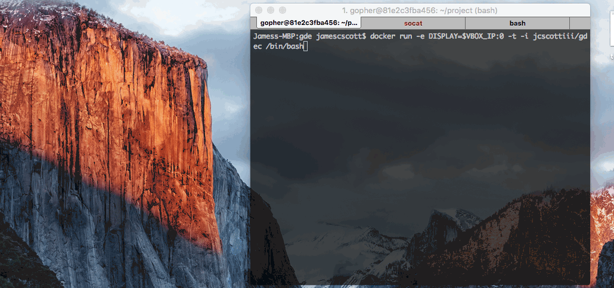
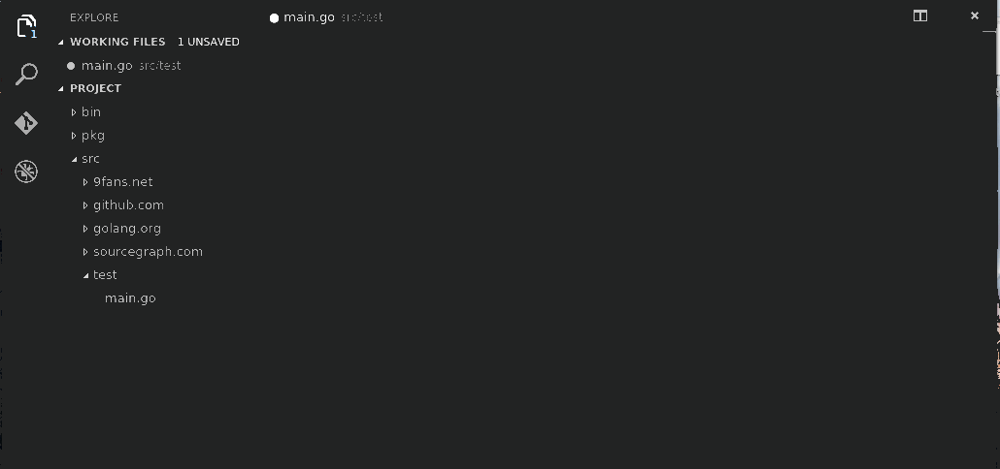

# Visual Studio Code Image

## Docker Image: `jcscottiii/vscode-gdec` 

## Table of Contents
- [Image Description](#image-description)
- [Image Contents](#image-contents)
- [Running](#running)
- [Usage](#usage)
- [Screenshots](#screenshots)

## Image Description
This image is the basis of the image to do barebone Go development. It does not setup any editors for Go.

## Image Contents
TODO

## Running
- Run the Docker container per your OS in the instructions [here](../base/gui/README.md#running) where your `GDEC_IMAGE` equals `jcscottiii/vscode-gdec`
- Once in the container, run this to start the IDE.
  - `code &`
## Usage
### Using Visual Studio Code
#### Debugger
When you run `code .`, it will start up the IDE at $GOPATH. You will begin to put your source code in $GOPATH/src. The picture above assumes you have package called `test` with a file called `main.go` in the `src` folder (i.e. $GOPATH/src/test/main.go). Press the green play button and a dropdown will appear, select `Go`, it will show `launch.json`. You will want to set the `program` field to `src/test`. If for some reason, you missed the Go option, delete your launch.json

## Screenshots
#### Starting up visual studio code in the container

Follow the running instructions for your OS.

#### Editing Go file in Visual Studio Code

Creating a hello world app

#### Debugging Go file in Visual Studio Code

- Note: The screen capture tool is unable to show the breakpoints being set, but they are. You click to the left of the line numbers.

